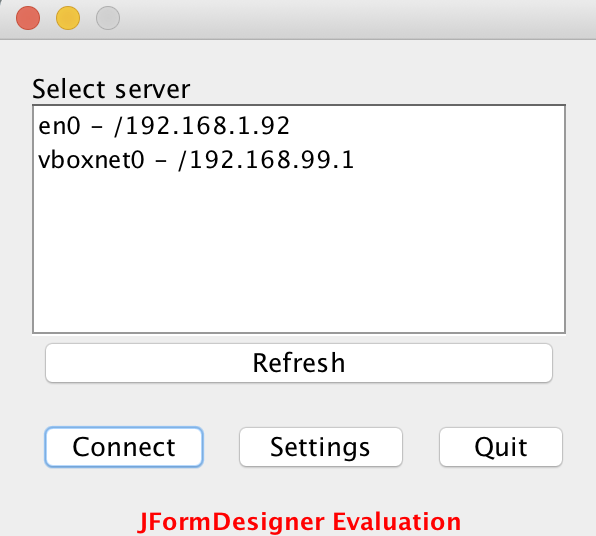

Java LAN Chat
=============

A simple Jav server/client program that lets you chat between computers on a home network.

Created mainly for fun, as there are hundreds of alternatives out there. My main problem was an easy way of sending messages between computers *without* using services such as mail, Facebook, and so on.

## Features

* Network discovery using UDP/broadcasting
* TCP server is a simple echo server that forwards all messages to all connected clients

## TODO

* Encrypted communication
* Show list of connected clients to all clients
* Resolve IP addresses to hostnames

## Screenshots

### Server

### Client

